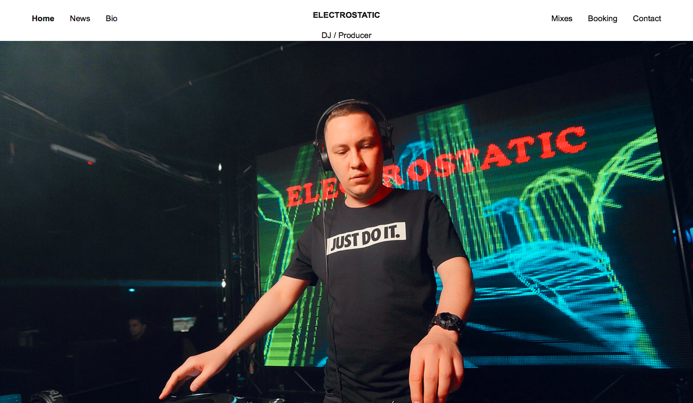

# dj-booking 

## Features

🌿  `* My Soundcloud, Twitter, Facebook widgets.`

  

## 👨‍💻 Author

 
  

<b>Lenar Gasimov</b> Python developer | Python, Django, Flask.

    

## 💸 Donations

Feel free to use the :octocat: GitHub Sponsor button to donate towards my work if you're feeling generous ☕️

#### 🚧 Under construction... 🚧

